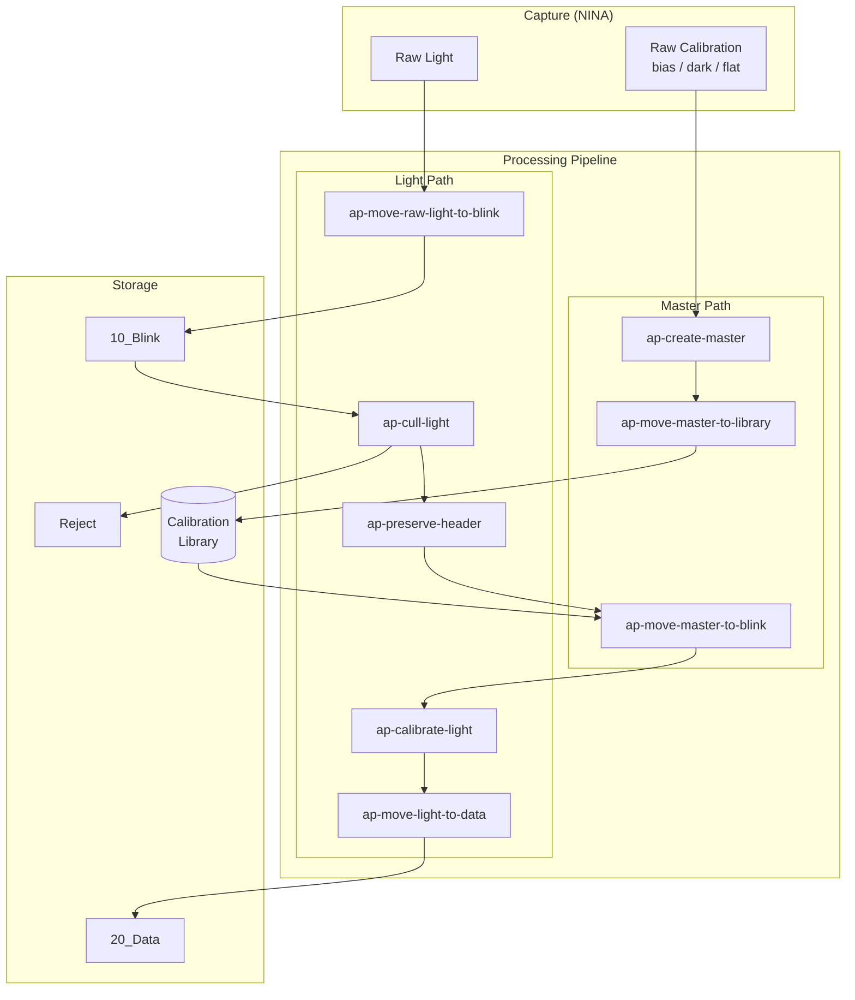
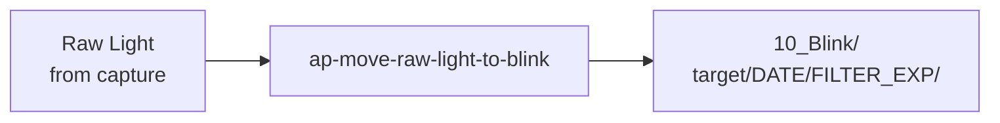
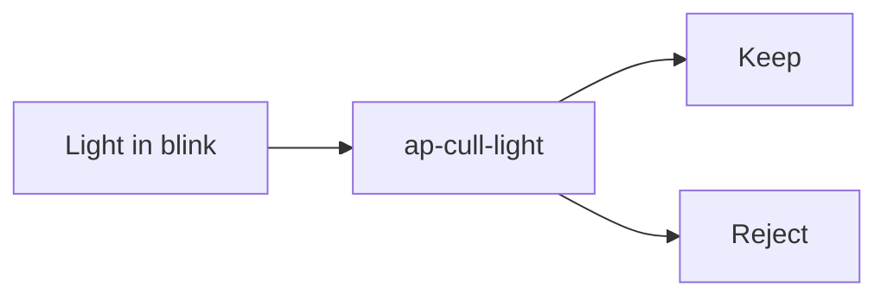
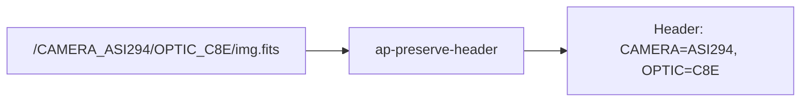
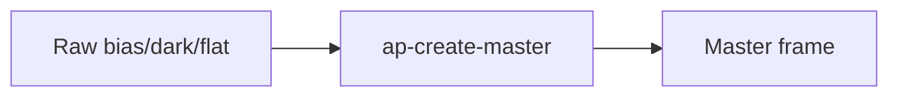
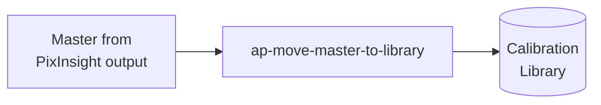
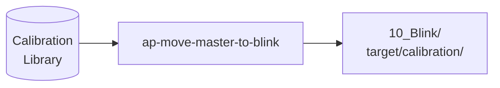
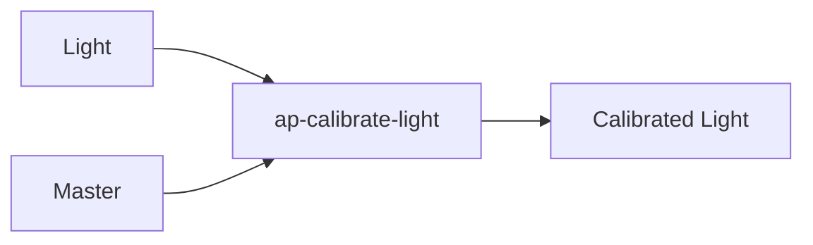
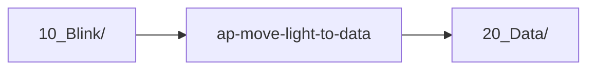
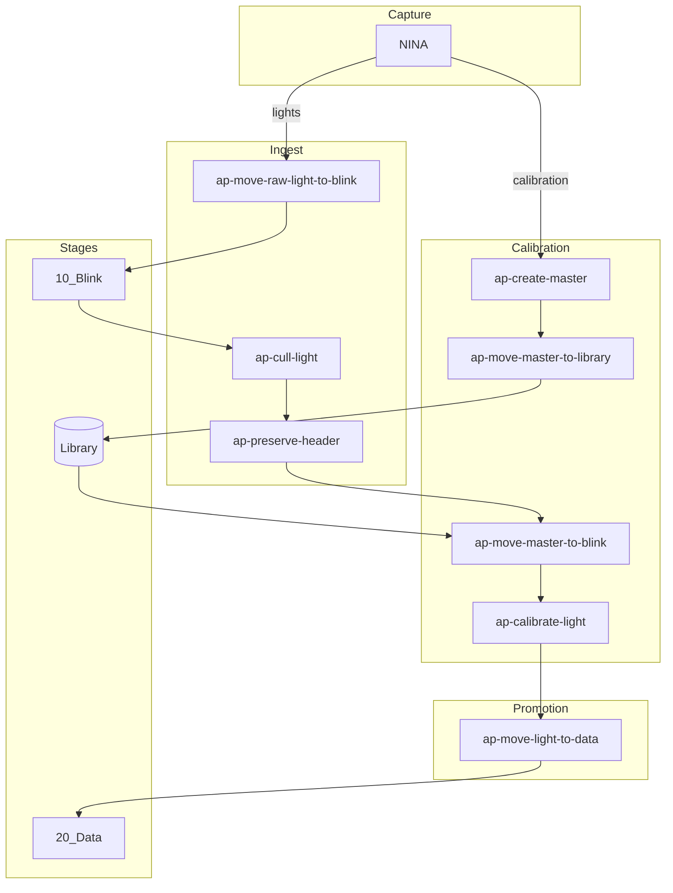

# Suggested Project Renames

## Naming Taxonomy

### Nouns (singular, consistent)

| Noun | Definition |
|------|------------|
| **light** | A light frame (science image of a target) |
| **master** | An integrated calibration frame (bias, dark, or flat) |
| **header** | Metadata stored in the file |

### Destinations

| Destination | Directory | Purpose |
|-------------|-----------|---------|
| **blink** | `10_Blink/` | Initial QC stage, visual review |
| **data** | `20_Data/` | Accepted frames, collecting more |
| **library** | `Calibration/Library/` | Organized master frame storage |

### Qualifiers

| Qualifier | Meaning |
|-----------|---------|
| **raw** | Unprocessed, directly from capture |

### Verbs

| Verb | Action |
|------|--------|
| **create** | Generate (masters from raw frames) |
| **cull** | Filter/reject based on quality metrics |
| **calibrate** | Apply calibration frames to lights |
| **preserve** | Save metadata (e.g., path → header) |
| **move** | Transfer from one location to another |
| **delete** | Remove files/frames |
| **empty** | Clean up (e.g., remove empty directories) |

## Naming Pattern

All tools follow: `ap-{verb}-{qualifier?}-{noun}-to-{destination?}`

- Every tool name starts with a **verb**
- **Qualifier** (like `raw`) is optional
- **Noun** is always singular
- **Destination** is used when the tool moves data somewhere

## Data Flow



## Proposed Renames

### Summary Table

| Current | Proposed | Pattern | Rationale |
|---------|----------|---------|-----------|
| `ap-move-lights` | `ap-move-raw-light-to-blink` | verb-qualifier-noun-to-dest | Move raw lights from capture → blink |
| `ap-cull-lights` | `ap-cull-light` | verb-noun | Cull (reject) poor quality lights |
| `ap-fits-headers` | `ap-preserve-header` | verb-noun | Preserve path metadata into header |
| `ap-master-calibration` | `ap-create-master` | verb-noun | Create masters from raw calibration |
| `ap-move-calibration` | `ap-move-master-to-library` | verb-noun-to-dest | Move masters → library |
| `ap-move-lights-to-data` | `ap-move-light-to-data` | verb-noun-to-dest | Move accepted lights from blink → data |
| `ap-common` | `ap-common` | — | Shared utilities (no change) |
| `ap-empty-directory` | `ap-empty-directory` | verb-noun | Clean up empty directories (no change) |

### Future Projects

| Name | Pattern | Purpose |
|------|---------|---------|
| `ap-move-master-to-blink` | verb-noun-to-dest | Copy matching masters from library → blink for a target |
| `ap-calibrate-light` | verb-noun | Apply masters to lights |

## Detailed Analysis

### ap-move-raw-light-to-blink (was: ap-move-lights)

**Pattern:** `verb-qualifier-noun-to-destination`

The tool moves raw light frames from NINA capture directory into the organized `10_Blink` structure.



### ap-cull-light (was: ap-cull-lights)

**Pattern:** `verb-noun`

The tool culls (rejects) lights based on HFR and RMS thresholds.



### ap-preserve-header (was: ap-fits-headers)

**Pattern:** `verb-noun`

The tool preserves path-encoded metadata into the file header. The key insight: we're not modifying FITS specifically—we're preserving information that would otherwise be lost.



### ap-create-master (was: ap-master-calibration)

**Pattern:** `verb-noun`

The tool creates master calibration frames by integrating raw bias/dark/flat frames via PixInsight.



### ap-move-master-to-library (was: ap-move-calibration)

**Pattern:** `verb-noun-to-destination`

The tool moves master frames from PixInsight output into the organized calibration library.



### ap-move-master-to-blink (new)

**Pattern:** `verb-noun-to-destination`

Copy matching masters from the library into the blink directory for a specific target, enabling calibration.



**Matching logic:**
- Read light frame headers in target directory
- Find matching bias (camera, temp, gain, offset)
- Find matching dark (+ exposure)
- Find matching flat (+ filter, nearest date)
- Copy to target's calibration subdirectory

### ap-calibrate-light (new)

**Pattern:** `verb-noun`

Apply calibration masters to light frames (may wrap PixInsight WBPP or similar).



### ap-move-light-to-data (was: ap-move-lights-to-data)

**Pattern:** `verb-noun-to-destination`

Move accepted lights from blink to data stage.



## Complete Workflow with New Names



## Module/Package Names

Python packages use underscores:

| Project | Package |
|---------|---------|
| `ap-move-raw-light-to-blink` | `ap_move_raw_light_to_blink` |
| `ap-cull-light` | `ap_cull_light` |
| `ap-preserve-header` | `ap_preserve_header` |
| `ap-create-master` | `ap_create_master` |
| `ap-move-master-to-library` | `ap_move_master_to_library` |
| `ap-move-master-to-blink` | `ap_move_master_to_blink` |
| `ap-calibrate-light` | `ap_calibrate_light` |
| `ap-move-light-to-data` | `ap_move_light_to_data` |

## Implementation Plan

This rename will be executed in three phases:

### Phase 1: Repository Renames (Manual - User)

The user will rename GitHub repositories on both upstream (`jewzaam`) and fork (`thelenorith`):

| Current Repository | New Repository |
|-------------------|----------------|
| `ap-move-lights` | `ap-move-raw-light-to-blink` |
| `ap-cull-lights` | `ap-cull-light` |
| `ap-fits-headers` | `ap-preserve-header` |
| `ap-master-calibration` | `ap-create-master` |
| `ap-move-calibration` | `ap-move-master-to-library` |
| `ap-move-lights-to-data` | `ap-move-light-to-data` |

**Steps:**
1. On GitHub, rename each repository (Settings → Rename)
2. Verify both `jewzaam` and `thelenorith` orgs are updated
3. GitHub automatically sets up redirects from old names

### Phase 2: Update ap-base Submodules

After repo renames complete, update `ap-base` to reference new repository names:

**Automated steps:**

```bash
# In ap-base
make deinit
make init

# Update .gitmodules to reference new repo URLs
# Git will automatically handle the redirect, but we'll update to correct names

git submodule sync
git submodule update --remote
```

**Files to update in ap-base:**

- `.gitmodules` - Update all submodule URLs to new repository names
- `patches/` - Rename patch subdirectories if organized by repo name
- `Makefile` - Update any hardcoded repository references
- `CLAUDE.md` - Update repository structure documentation
- `README.md` - Update submodule list
- `standards/naming.md` - Already updated with new names

**Create PR for ap-base:**
- Branch: `rename-repos-YYYYMMDD`
- Update all references to old names
- Commit submodule pointer updates

### Phase 3: Update Each Submodule

For each renamed repository, create a PR to update internal naming:

**Branch naming:** `rename-package-YYYYMMDD`

**Changes per repository:**

1. **pyproject.toml**
   - `[project].name` → new project name (hyphenated)
   - Package name → new package name (underscored)
   - Update description if it references old name

2. **Package directory rename**
   - `mv ap_old_name/ ap_new_name/`
   - Update all imports in code
   - Update `MANIFEST.in` include patterns

3. **README.md**
   - Title
   - Badges (URLs contain repo name)
   - Installation instructions (`pip install`)
   - Usage examples (package imports)
   - Repository links

4. **GitHub Actions workflows** (`.github/workflows/*.yml`)
   - No changes needed (reference relative paths)

5. **CLI entry points**
   - Update script names in `pyproject.toml` `[project.scripts]`
   - Update help text that mentions command name

6. **CHANGELOG.md**
   - Add entry documenting the rename

**PR Checklist per repository:**

- [ ] Package directory renamed
- [ ] `pyproject.toml` updated (project name, package name)
- [ ] All imports updated
- [ ] CLI entry points updated
- [ ] README updated (title, badges, examples, links)
- [ ] CHANGELOG entry added
- [ ] Tests pass
- [ ] Documentation builds (if applicable)

**Order of PR creation:**

1. `ap-common` (no dependencies)
2. Repositories that depend on `ap-common`:
   - `ap-move-raw-light-to-blink`
   - `ap-cull-light`
   - `ap-preserve-header`
   - `ap-create-master`
   - `ap-move-master-to-library`
   - `ap-move-light-to-data`

### Rollback Plan

If issues arise:

1. **Phase 1 rollback**: Rename repositories back on GitHub
2. **Phase 2 rollback**: Revert ap-base PR
3. **Phase 3 rollback**: Close PRs without merging

GitHub's automatic redirects prevent broken clones during transition.

## Detailed Changes by Repository

### ap-move-raw-light-to-blink (was: ap-move-lights)

```bash
# Rename package directory
mv ap_move_lights/ ap_move_raw_light_to_blink/

# Update imports
find . -name "*.py" -exec sed -i 's/ap_move_lights/ap_move_raw_light_to_blink/g' {} +
```

**pyproject.toml:**
```diff
 [project]
-name = "ap-move-lights"
+name = "ap-move-raw-light-to-blink"
-description = "Move light frames into organized structure"
+description = "Move raw light frames from capture to blink directory"

+[project.scripts]
+ap-move-raw-light-to-blink = "ap_move_raw_light_to_blink.__main__:main"
```

**README.md:**
```diff
-# ap-move-lights
+# ap-move-raw-light-to-blink

-pip install ap-move-lights
+pip install ap-move-raw-light-to-blink

-import ap_move_lights
+import ap_move_raw_light_to_blink
```

### ap-cull-light (was: ap-cull-lights)

```bash
mv ap_cull_lights/ ap_cull_light/
find . -name "*.py" -exec sed -i 's/ap_cull_lights/ap_cull_light/g' {} +
```

**pyproject.toml:**
```diff
 [project]
-name = "ap-cull-lights"
+name = "ap-cull-light"
-description = "Cull poor quality light frames"
+description = "Cull poor quality light frames based on HFR and RMS"

+[project.scripts]
+ap-cull-light = "ap_cull_light.__main__:main"
```

### ap-preserve-header (was: ap-fits-headers)

```bash
mv ap_fits_headers/ ap_preserve_header/
find . -name "*.py" -exec sed -i 's/ap_fits_headers/ap_preserve_header/g' {} +
```

**pyproject.toml:**
```diff
 [project]
-name = "ap-fits-headers"
+name = "ap-preserve-header"
-description = "Manage FITS header metadata"
+description = "Preserve path metadata into FITS headers"

+[project.scripts]
+ap-preserve-header = "ap_preserve_header.__main__:main"
```

### ap-create-master (was: ap-master-calibration)

```bash
mv ap_master_calibration/ ap_create_master/
find . -name "*.py" -exec sed -i 's/ap_master_calibration/ap_create_master/g' {} +
```

**pyproject.toml:**
```diff
 [project]
-name = "ap-master-calibration"
+name = "ap-create-master"
-description = "Create master calibration frames"
+description = "Create master calibration frames via PixInsight integration"

+[project.scripts]
+ap-create-master = "ap_create_master.__main__:main"
```

### ap-move-master-to-library (was: ap-move-calibration)

```bash
mv ap_move_calibration/ ap_move_master_to_library/
find . -name "*.py" -exec sed -i 's/ap_move_calibration/ap_move_master_to_library/g' {} +
```

**pyproject.toml:**
```diff
 [project]
-name = "ap-move-calibration"
+name = "ap-move-master-to-library"
-description = "Move calibration frames to library"
+description = "Move master calibration frames to organized library"

+[project.scripts]
+ap-move-master-to-library = "ap_move_master_to_library.__main__:main"
```

### ap-move-light-to-data (was: ap-move-lights-to-data)

```bash
mv ap_move_lights_to_data/ ap_move_light_to_data/
find . -name "*.py" -exec sed -i 's/ap_move_lights_to_data/ap_move_light_to_data/g' {} +
```

**pyproject.toml:**
```diff
 [project]
-name = "ap-move-lights-to-data"
+name = "ap-move-light-to-data"
-description = "Move light frames to data"
+description = "Move accepted light frames from blink to data stage"

+[project.scripts]
+ap-move-light-to-data = "ap_move_light_to_data.__main__:main"
```

## Testing Strategy

After each repository rename:

1. **Build test:**
   ```bash
   python -m build
   ```

2. **Install test:**
   ```bash
   pip install -e .[dev]
   ```

3. **Import test:**
   ```python
   import ap_<new_name>
   ```

4. **CLI test:**
   ```bash
   ap-<new-name> --help
   ```

5. **Unit tests:**
   ```bash
   make test
   make coverage
   ```

6. **Lint/format:**
   ```bash
   make format
   make lint
   ```

## Communication Plan

1. **Before Phase 1:**
   - Document current state in `SUGGESTED_RENAMES.md`
   - Review with stakeholders

2. **After Phase 1:**
   - Update ap-base README with status
   - Note that repositories have been renamed

3. **During Phase 3:**
   - PR descriptions link to this document
   - CHANGELOG entries explain rename rationale

4. **After completion:**
   - Update all external documentation
   - Announce on any project channels

## Validation Checklist

After all phases complete:

- [ ] All repositories renamed on GitHub
- [ ] ap-base `.gitmodules` references correct URLs
- [ ] All submodules point to correct commits
- [ ] Each package builds without errors
- [ ] Each package installs with pip
- [ ] CLI commands work with new names
- [ ] All tests pass in all repositories
- [ ] README badges show correct status
- [ ] Documentation is consistent across all repos
