# Presentation Diagrams

Drill-down diagrams for presenting the astrophotography pipeline. Each level adds detail, building from the goal to the full automated workflow.

See [legend.md](legend.md) for color standards.

---

## Data Stages

How data progresses through the workflow. Each numbered stage represents a state in the pipeline. Colors flow from warm (early) to cool (late) to green (done).

**Left-Right**

```mermaid
flowchart LR
    RAW[Raw Capture] --> BLINK[10_Blink]
    BLINK --> DATA[20_Data]
    DATA --> MASTER[30_Master]
    MASTER --> PROCESS[40_Process]
    PROCESS --> BAKE[50_Bake]
    BAKE --> DONE[60_Done]

    classDef rawStyle fill:#bcaaa4,stroke:#795548,stroke-width:2px,color:#000
    classDef blinkStyle fill:#ffcc80,stroke:#ff9800,stroke-width:2px,color:#000
    classDef dataStage fill:#fff176,stroke:#f9a825,stroke-width:2px,color:#000
    classDef masterStyle fill:#80deea,stroke:#00acc1,stroke-width:2px,color:#000
    classDef processStage fill:#90caf9,stroke:#1565c0,stroke-width:2px,color:#000
    classDef bakeStyle fill:#ce93d8,stroke:#ab47bc,stroke-width:2px,color:#000
    classDef doneStyle fill:#a5d6a7,stroke:#4caf50,stroke-width:2px,color:#000

    class RAW rawStyle
    class BLINK blinkStyle
    class DATA dataStage
    class MASTER masterStyle
    class PROCESS processStage
    class BAKE bakeStyle
    class DONE doneStyle
```

**Top-Down**

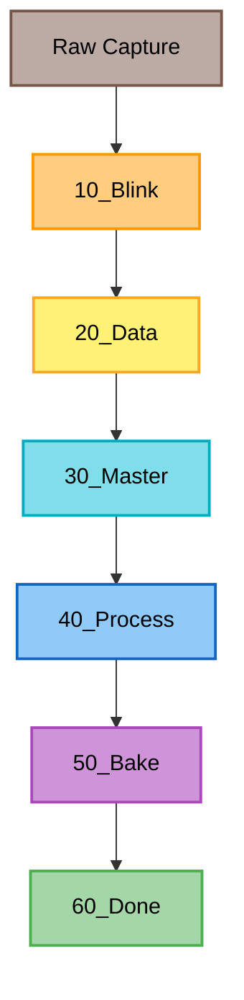

| Stage | State |
|-------|-------|
| Raw Capture | Unprocessed files from camera |
| 10_Blink | Initial review and quality control |
| 20_Data | Calibration matched, collecting data |
| 30_Master | Creating master lights |
| 40_Process | Active processing in PixInsight |
| 50_Bake | Final review before publishing |
| 60_Done | Published, ready for archive |

---

## Level 1: The Goal

What are we trying to achieve?

**Top-Down**

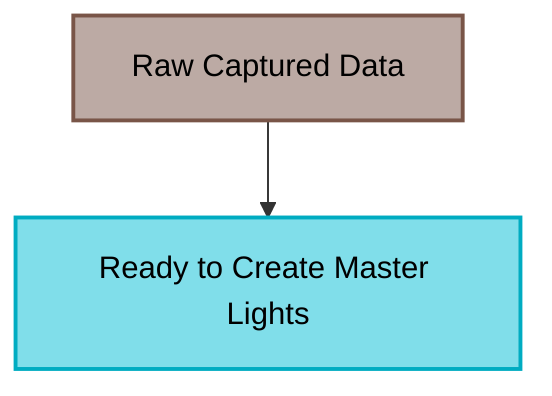

**Left-Right**

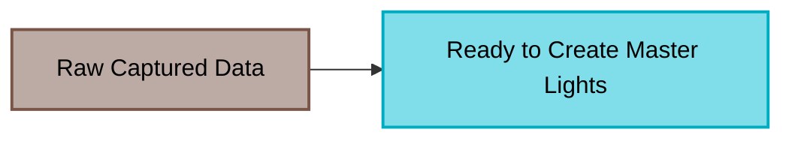

---

## Level 2: Functional Steps

What needs to happen to get there? Two parallel paths converge.

**Top-Down**

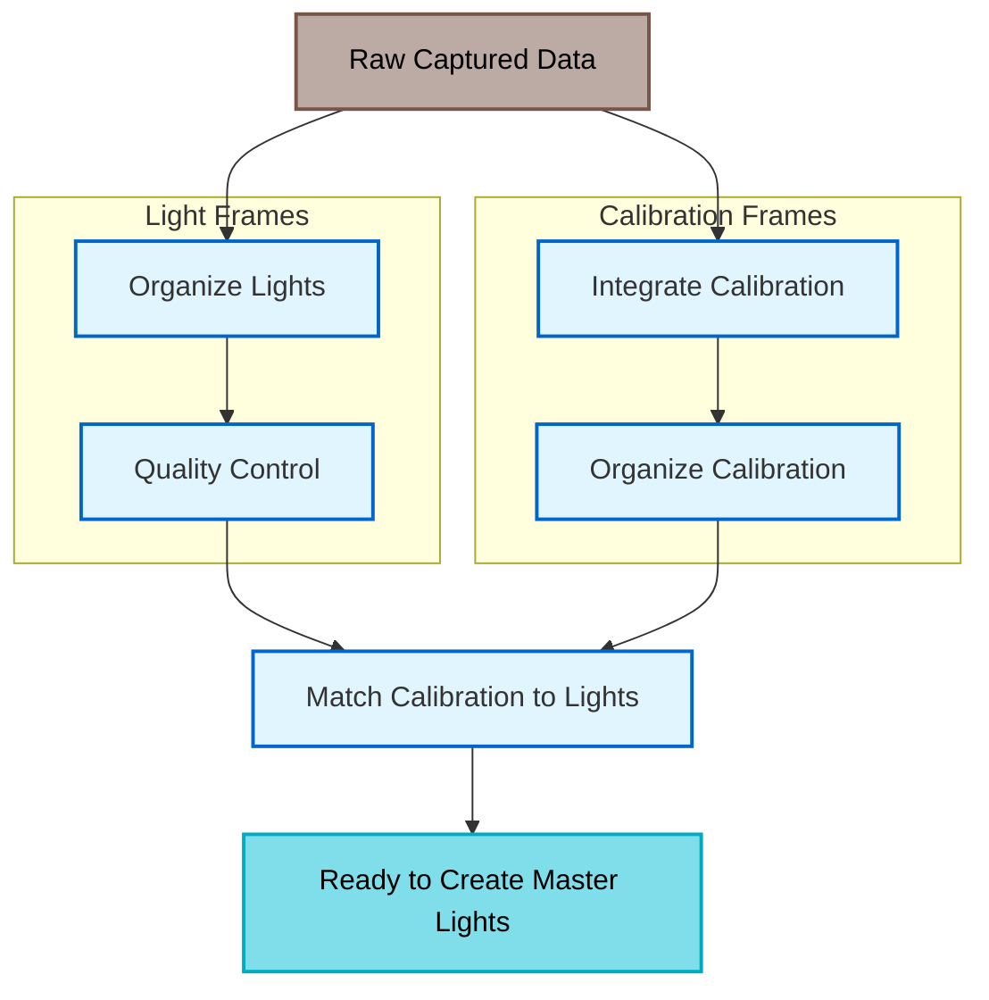

**Left-Right**

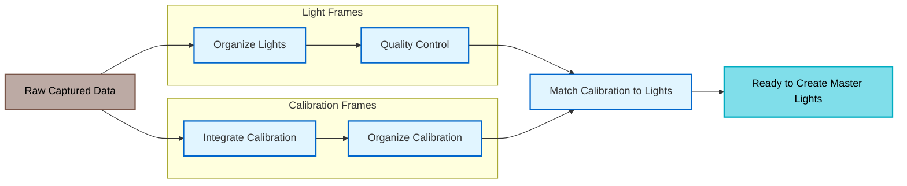

---

## Level 3: Automation Per Step

For each functional step, the tool that automates it. Manual steps highlighted in orange.

**Top-Down**

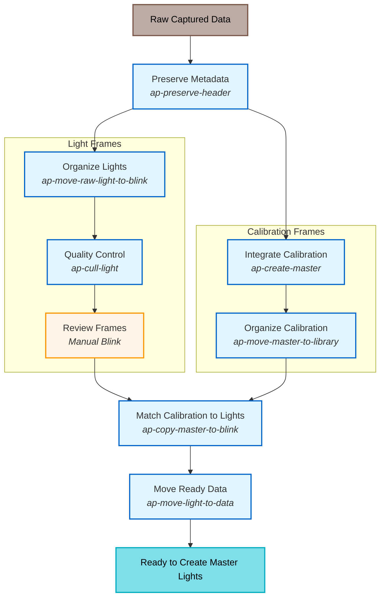

**Left-Right**

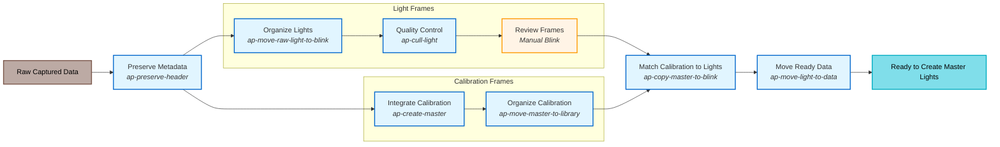

---

## Level 4: End-to-End with Manual Steps

Full pipeline. Manual steps are orange, automated steps are blue, data is green.

**Top-Down**

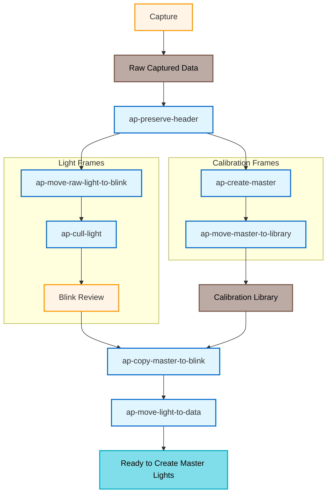

**Left-Right**

```mermaid
flowchart LR
    CAPTURE[Capture] --> RAW[Raw Captured Data]
    RAW --> PH[ap-preserve-header]

    subgraph Lights["Light Frames"]
        direction LR
        MOVE[ap-move-raw-light-to-blink]
        CULL[ap-cull-light]
        BLINK[Blink Review]
        MOVE --> CULL --> BLINK
    end

    subgraph Calibration["Calibration Frames"]
        direction LR
        CREATE[ap-create-master]
        ORGANIZE[ap-move-master-to-library]
        CREATE --> ORGANIZE
    end

    PH --> MOVE
    PH --> CREATE

    BLINK --> COPY[ap-copy-master-to-blink]
    ORGANIZE --> LIBRARY[Calibration Library]
    LIBRARY --> COPY
    COPY --> MOVE_DATA[ap-move-light-to-data]
    MOVE_DATA --> READY[Ready to Create Master Lights]

    classDef rawStyle fill:#bcaaa4,stroke:#795548,stroke-width:2px,color:#000
    classDef processStyle fill:#e1f5ff,stroke:#0066cc,stroke-width:2px
    classDef manualStyle fill:#fff4e6,stroke:#ff9800,stroke-width:2px
    classDef masterStyle fill:#80deea,stroke:#00acc1,stroke-width:2px,color:#000

    class PH,MOVE,CULL,CREATE,ORGANIZE,COPY,MOVE_DATA processStyle
    class CAPTURE,BLINK manualStyle
    class RAW,LIBRARY rawStyle
    class READY masterStyle
```

---

## Workflow Overview

Full workflow with all tools and data nodes. Covers capture through to 30_Master.

**Top-Down**

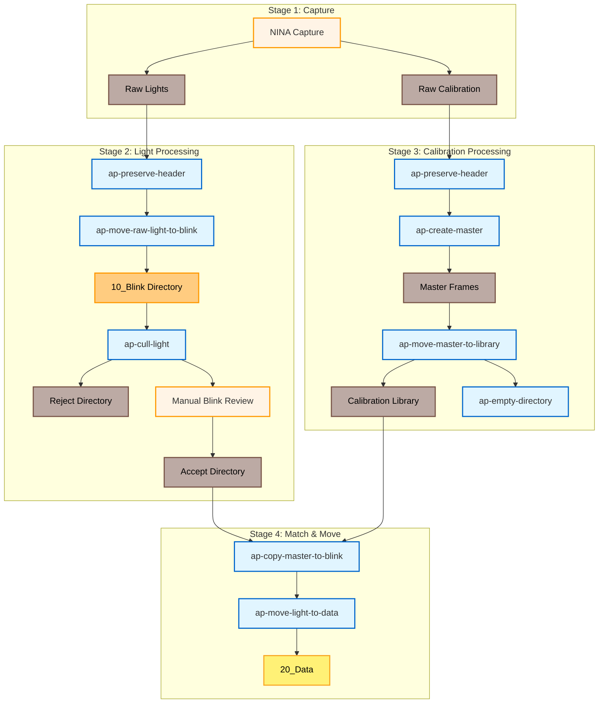

**Left-Right**

```mermaid
flowchart LR
    subgraph Stage1["Stage 1: Capture"]
        NINA[NINA Capture] --> RAW_Light[Raw Lights]
        NINA --> RAW_Cal[Raw Calibration]
    end

    subgraph Stage2["Stage 2: Light Processing"]
        RAW_Light --> PH_L[ap-preserve-header]
        PH_L --> MOVE[ap-move-raw-light-to-blink]
        MOVE --> BLINK[10_Blink Directory]
        BLINK --> CULL[ap-cull-light]
        CULL --> REJECT[Reject Directory]
        CULL --> MANUAL[Manual Blink Review]
        MANUAL --> ACCEPT[Accept Directory]
    end

    subgraph Stage3["Stage 3: Calibration Processing"]
        RAW_Cal --> PH_C[ap-preserve-header]
        PH_C --> MASTER[ap-create-master]
        MASTER --> MASTERS[Master Frames]
        MASTERS --> ORGANIZE[ap-move-master-to-library]
        ORGANIZE --> LIBRARY[Calibration Library]
        ORGANIZE --> CLEANUP1[ap-empty-directory]
    end

    subgraph Stage4["Stage 4: Match & Move"]
        ACCEPT --> COPY_CAL[ap-copy-master-to-blink]
        LIBRARY --> COPY_CAL
        COPY_CAL --> MOVE_DATA[ap-move-light-to-data]
        MOVE_DATA --> DATA[20_Data]
    end

    classDef rawStyle fill:#bcaaa4,stroke:#795548,stroke-width:2px,color:#000
    classDef processStyle fill:#e1f5ff,stroke:#0066cc,stroke-width:2px
    classDef manualStyle fill:#fff4e6,stroke:#ff9800,stroke-width:2px
    classDef blinkStyle fill:#ffcc80,stroke:#ff9800,stroke-width:2px,color:#000
    classDef dataStage fill:#fff176,stroke:#f9a825,stroke-width:2px,color:#000

    class PH_L,MOVE,CULL,PH_C,MASTER,ORGANIZE,COPY_CAL,MOVE_DATA,CLEANUP1 processStyle
    class NINA,MANUAL manualStyle
    class RAW_Light,RAW_Cal,REJECT,ACCEPT,MASTERS,LIBRARY rawStyle
    class BLINK blinkStyle
    class DATA dataStage
```
