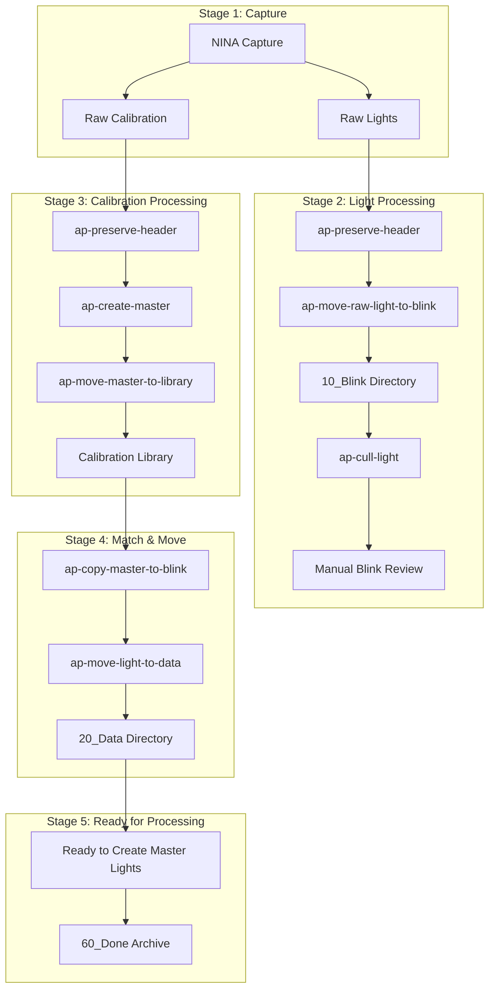

# From Raw to Ready: Hands-Free Astrophotography Data Management

**Duration:** 45-60 minutes (including Q&A)

**Target Audience:** Entry and mid-level astrophotographers interested in workflow automation

---

## Conference Abstract (175 words)

After a long night capturing astrophotography data, you don't want to spend your time sorting through hundreds of files and matching calibration masters. You want to start looking at your data - moving from collected information to building master lights.

This presentation demonstrates a modular pipeline of tools that automates the tedious post-capture workflow: organizing files by metadata, initial automated culling of poor-quality frames, managing calibration libraries, and matching masters to lights. These metadata-driven tools handle almost everything from your capture software's output to being ready to create your master lights.

We'll walk through the problems these tools solve, the design philosophy behind them, and see the pipeline in action through a live demo. This pipeline has evolved from monolithic scripts into a clean, focused set of tools refined through years of real-world use.

Perfect for astrophotographers wanting to spend less time organizing and more time creating stunning images using free, open source tooling.

---

## Three Bullet Point Takeaways

**What will the audience walk away with?**

1. **Automate post-capture organization** - Metadata-driven tools handle file organization, quality control, and calibration matching based on FITS headers

2. **Modular pipeline of discrete tools** - Pick and choose the tools that solve your specific problems; use one, some, or all

3. **Open source and extensible** - Apache-2.0 license, tested with NINA/PixInsight, designed to work with any FITS metadata; contributions welcome

---

## Presentation Flow

| Section | Slides | Minutes | Purpose |
|---------|--------|---------|---------|
| Problem & Context | 1-6 | 11 | Set the stage, establish credibility, show the vision |
| The Tools | 7-16 | 20 | CLI standards + individual tool explanations |
| Demo & Getting Started | 17-18 | 18 | Show it working, installation |
| Wrap & Q&A | 19-21 | 11 | Takeaways, resources, questions |

**Total:** ~51 minutes + Q&A buffer

---

## Act 1: Problem & Context

### Slide 1: Title

**From Raw to Ready:**
**Hands-Free Astrophotography Data Management**

Your name / date

*Open Source (Apache-2.0 License)*
*Free tooling for astrophotographers*

*Intent: Set the tone — this is about solving real problems with tools that actually work.*

**Duration:** 0.5 minutes

---

### Slide 2: The Problem

- After a night of imaging — hundreds of files to manage
- Lights, darks, flats, bias — scattered across directories
- Quality varies frame by frame (especially lights)
- Matching calibration to lights is manual and time-consuming
- You want to be processing, not organizing

*Intent: Resonate with the audience. Everyone has felt this pain. Don't belabor it — they know.*

**Relatability moment:** "Raise your hand if you've ever spent more than an hour organizing files after a clear night"

**Duration:** 2 minutes

---

### Slide 3: The Journey

**From Problem to Solution:**

- Started as monolithic scripts solving my own real problems
- 5 years of iteration and refinement with actual imaging sessions
- Recently: organized into clean, focused tools with Claude Code assistance
- Measured time savings: [X hours manual → Y minutes automated per session]*

**Key insight:** "Build tools that solve your actual problems, not theoretical ones"

**Result:** Modular, open source, community-driven pipeline

*Intent: Establish credibility quickly. Show this comes from real experience.*

*\*Note: Gather actual time metrics before presentation*

**Duration:** 1 minute

---

### Slide 4: What If It Just... Worked?

- Capture finishes
- Run a few commands
- Bad frames rejected (with optional manual review)
- Calibration matched automatically
- Files organized and ready to create your master lights

*Intent: Paint the vision before explaining the how. Quick aspirational slide. Be honest about automation limits — user can still review and override.*

**Duration:** 1-2 minutes

---

### Slide 5: The Pipeline at a Glance

**Visual:** Workflow diagram from `docs/workflow.md`



**Key Points:**
- Capture → Organize → Cull → Calibrate → Match → Ready
- Each step is a standalone tool
- Use one, some, or all - modular by design

*Intent: Show the full picture before diving in. Emphasize modularity and that this is an enablement tool (prepares for processing, not processing itself).*

**Duration:** 2 minutes

---

### Slide 6: Directory Structure

**Visual:** Directory tree from `docs/directory-structure.md`

**Data Directory (Numbered Stages):**
```
Data/
  Optic+Camera/
    10_Blink/     ← Initial review, quality check
    20_Data/      ← Collecting more data, calibration needs
    30_Master/    ← Creating master lights (integration)
    40_Process/   ← Active processing in PixInsight
    50_Bake/      ← Final review before publishing
    60_Done/      ← Published, ready for archive
```

**Calibration Library:**
```
Library/
  MASTER BIAS/Camera/Temp/Gain/Offset/
  MASTER DARK/Camera/Temp/Gain/Offset/Exposure/
  MASTER FLAT/Camera/Optic/Date/Filter/Exposure/
```

**Source Data Flexibility:**
> **Important:** This pipeline doesn't care what your source data looks like - as long as you have FITS files with the right metadata, you're good.

**Metadata Override Support:**
> The tools support metadata overrides from path and file names using key-value pair syntax (borrowed from PixInsight conventions). This allows preserving critical metadata even when capture software doesn't write it to FITS headers.

**Data Retention Philosophy:**
> **Guiding Tenet:** Keep master calibration frames and raw light frames. Master lights can be recreated if needed, but raw data cannot.

**Key Points:**
- Numbered stages = natural progression through workflow
- Organized by equipment, target, date, filter
- Calibration library enables reuse:
  - Bias and darks persist (cooled cameras)
  - Flats organized by date (take new ones as needed)

*Intent: Show the organizational philosophy. The numbered stages are immediately intuitive. Introduce the calibration library concept early. Clarifies flexibility, explains ap-preserve-header rationale, establishes data retention strategy.*

**Duration:** 2 minutes

---

### Slide 7: CLI Standards - Safety and Consistency

**Before we dive into tools, know that they all share these features:**

**Safety First:**
- `--dryrun` - See what will happen without making changes
- `--debug` - Detailed step-by-step output
- `--quiet` - Minimal output for scripting
- **Combined:** `--debug --dryrun` - See exactly what it would do

**Example:**
```bash
ap-move-raw-light-to-blink /raw /data --dryrun
# Preview: shows what would be moved where
# No files actually moved until you're ready
```

**Consistent across all tools** - Learn once, use everywhere

*Intent: Establish trust and safety before tool demonstrations. Show that the tools are designed to be explored safely.*

**Relatability moment:** "Always test with --dryrun first - I learned that the hard way"

**Duration:** 2 minutes

---

## Act 2: The Tools (One Tool Per Slide)

**Before diving into individual tools, let's establish how they all work:**

**Each tool slide shows:**
- Workflow diagram with **this step highlighted**, rest dimmed
- What the tool does
- Where it fits in the overall workflow
- Usage notes

---

### Slide 8: Tool 1 - ap-preserve-header

**Workflow Context:** *(Show diagram with ap-preserve-header highlighted)*

**What it does:**
- Extracts key-value pairs from file paths and filenames
- Writes specified metadata into FITS headers **before** anything moves
- Supports PixInsight key-value pair syntax in paths
- Idempotent, safe to re-run

**Why this matters:**
- Path-based metadata must be preserved before file movement
- Works with any capture software that uses structured paths
- NINA users benefit because NINA encodes metadata in paths (camera, filter, temp, HFR, RMS...)
- Other software may write headers directly (SharpCap, ASIAIR) - this tool still works but may not be needed

**Usage:**
```bash
ap-preserve-header /raw --include CAMERA OPTIC FILTER
```

**Key insight:** "This tool is capture-software agnostic - it works with any structured file paths, regardless of capture software"

*Intent: Explain path-based metadata extraction and why it exists. Set expectations that rest of tools are metadata-driven.*

**Duration:** 2 minutes

---

### Slide 9: Tool 2 - ap-move-raw-light-to-blink

**Workflow Context:** *(Show diagram with ap-move-raw-light-to-blink highlighted)*

**What it does:**
- Reads FITS headers to extract metadata
- Organizes lights by optic, camera, target, date, filter
- Creates structured workflow directories
- Creates `accept/` folders for manual review

**Result:** Capture chaos → organized `10_Blink` structure

**Usage:**
```bash
ap-move-raw-light-to-blink /raw /data
```

**Before:** 300 random files in one directory
**After:** Organized by equipment/target/date/filter

**Visual Example:**
> Include mosaic panel example showing:
> - FILTER_L_EXP_300_PANEL_1/
> - FILTER_L_EXP_300_PANEL_2/
> - FILTER_L_EXP_300_PANEL_3/
>
> Demonstrates how the tool handles complex multi-panel imaging projects

**Key insight:** "Metadata-driven organization - works with any FITS files with proper headers"

*Intent: Show the first visual payoff - instant organization.*

**Relatability moment:** "Watch how 300 random files become a structured workflow in seconds"

**Duration:** 2 minutes

---

### Slide 10: Tool 3 - ap-cull-light

**Workflow Context:** *(Show diagram with ap-cull-light highlighted)*

**What it does:**
- Reads HFR (focus quality) and RMS (guiding error) from headers
- Rejects frames exceeding thresholds
- Batch processing with auto-accept logic

**Result:** Bad seeing? Clouds rolled in? Gone.

**Usage:**
```bash
ap-cull-light /data/10_Blink /reject --max-hfr 2.5 --max-rms 2.0
```

**Threshold Logic:**
- Reject if HFR > 2.5 (poor focus)
- Reject if RMS > 2.0 (guiding error)
- Auto-accept batch if rejection % is low

**Key insight:** "Quality control without opening every frame"

*Intent: Quality control automation with honest limits - user can review edge cases.*

**Relatability moment:** "HFR of 5.7? That's going straight to the reject bin"

**Duration:** 2 minutes

---

### Slide 11: Tool 4 - ap-create-master

**Workflow Context:** *(Show diagram with ap-create-master highlighted)*

**What it does:**
- Automatically groups calibration frames by metadata
- Drives PixInsight for integration
- Creates master bias, dark, and flat frames
- Calibrates flats with bias/dark masters during integration

**Grouping Keys:**
| Frame Type | Grouping Metadata |
|------------|-------------------|
| Bias | Camera, Temp, Gain, Offset |
| Dark | Above + Exposure |
| Flat | Above + Date, Filter |

**Usage:**
```bash
ap-create-master /calibration/raw /calibration/output \
  --pixinsight-binary "/path/to/PixInsight"
```

**Key insight:** "Automatic grouping + PixInsight integration = no manual selection"

*Intent: Show calibration workflow automation. PixInsight required for stacking.*

**Duration:** 2 minutes

---

### Slide 11.5: Calibration Frame Lifecycle

**Why Calibration Frames Change Over Time:**
- Camera sensor characteristics degrade over time (fact of electronics)
- Recommend replacing bias and dark libraries every 6-12 months
- Flats change more frequently (optic changes, dust, rotation)

**How the Library Handles This:**
- `ap-move-master-to-library` **overwrites** existing masters with same metadata
- Newer calibration frames automatically replace older ones
- This is why we copy masters to blink directories (preserve snapshot)

**Data Retention Strategy:**
- Keep master calibration frames (can be recreated, but time-consuming)
- Keep raw light frames (cannot be recreated)
- Master lights can be recreated if needed (keep if desired, but raw lights are critical)

*Intent: Explain why calibration library exists, why it overwrites, and what data retention philosophy guides the pipeline.*

**Duration:** 2 minutes

---

### Slide 12: Tool 5 - ap-move-master-to-library

**Workflow Context:** *(Show diagram with ap-move-master-to-library highlighted)*

**What it does:**
- Organizes master frames into reusable library structure
- Presents critical headers in path and filename
- Enables efficient lookup and matching

**Library Structure:**
```
Library/
  MASTER BIAS/Camera/masterBias_GAIN_100_OFFSET_10_SETTEMP_-10.xisf
  MASTER DARK/Camera/masterDark_EXPOSURE_300_GAIN_100_OFFSET_10.xisf
  MASTER FLAT/Camera/Optic/Date/masterFlat_FILTER_L_GAIN_100.xisf
```

**Usage:**
```bash
ap-move-master-to-library /calibration/output /library
```

**Key insight:** "Build your darks library once, reuse for a long time (replace every 6-12 months as sensors age)"

**Note:** When you create new master frames and run this tool, it overwrites existing masters with matching metadata. This ensures your library stays current as you replace aging calibration frames.

*Intent: Show library organization concept. Emphasize reusability with honest timeframes.*

**Duration:** 2 minutes

---

### Slide 13: Tool 6 - ap-copy-master-to-blink

**Workflow Context:** *(Show diagram with ap-copy-master-to-blink highlighted)*

**What it does:**
- Searches library for calibration matching each light's metadata
- Matches by camera, temp, gain, offset, filter, exposure, date
- Copies darks, flats, bias into the correct blink directories
- No more hunting through folders

**Matching Priority:**
| Frame Type | Match Criteria |
|------------|----------------|
| Bias | Camera, Temp, Gain, Offset (exact) |
| Dark | Above + Exposure (lower or equal preferred) |
| Flat | Above + Filter + Date (nearest date) |

**Usage:**
```bash
ap-copy-master-to-blink /library /data/Optic+Camera/10_Blink
```

**Why Copy Instead of Reference?**
- Calibration library changes over time (replacing aging frames)
- Copying creates a snapshot of calibration state at time of processing
- If you reprocess old data later, you have the exact calibration used
- Lights stay with their matched calibration throughout the workflow

**Key insight:** "This is the magic - automatic calibration matching"

*Intent: This is the killer feature. Emphasize the matching logic value and explain why we copy.*

**Relatability moment:** "No more hunting through folders at midnight wondering which dark matches which light"

**Duration:** 3 minutes

---

### Slide 14: Tool 7 - ap-move-light-to-data

**Workflow Context:** *(Show diagram with ap-move-light-to-data highlighted)*

**What it does:**
- Only moves lights when **all** required calibration is present
- Incomplete targets stay behind - clear signal of what's missing
- Atomic moves - no half-done state
- Preserves directory structure in destination

**Required Calibration:**
- Dark (matching camera, temp, gain, offset, readout mode)
- Flat (above + filter)
- Bias (only if dark exposure ≠ light exposure)

**Usage:**
```bash
ap-move-light-to-data /data/10_Blink /data/20_Data
```

**Result:** Lights + matching calibration, ready for PixInsight processing

**Key insight:** "Safety through completeness - won't move unless ready"

*Intent: Show the final step that ensures data is truly ready for processing.*

**Duration:** 2 minutes

---

### Slide 15: Tool 8 - ap-empty-directory (Utility)

**Workflow Context:** *(Show diagram with cleanup utility highlighted)*

**What it does:**
- Removes files from specified directory
- Optionally recurses with `--recursive`
- Automatically removes empty directories after file deletion
- Supports `--dryrun` to preview changes

**Common Cleanup Tasks:**
```bash
# Clean calibration output after moving to library
ap-empty-directory /calibration/output --recursive

# Preview cleanup before executing
ap-empty-directory /calibration/raw --recursive --dryrun
```

**Key insight:** "Cleanup is part of workflow hygiene"

**WARNING:** Only clean raw calibration **after** integrating **and** moving to library!

*Intent: Show utility tool for workflow maintenance.*

**Duration:** 1 minute

---

### Slide 16: What It Looks Like in Practice

**Transition to live demo**

**You've seen the individual tools. Now let's watch them work together.**

Real data from actual imaging session
Real commands
End-to-end workflow demonstration

**Optional visual:**
- Split-screen before/after of directory structures
- Screenshot of terminal output

*Intent: Bridge slide before the demo. Set expectations.*

**Duration:** 1 minute

---

## Act 3: Demo & Wrap

### Slide 17: Getting Started

**Installation:**
```bash
pip install git+https://github.com/jewzaam/ap-[tool-name].git
```

**Configuration:** (Using batch script templates from PR #79)

```batch
REM config.bat - Set your environment
SET RAW_DIR=D:\Astrophotography\Raw
SET DATA_DIR=D:\Astrophotography\Data
SET LIBRARY_DIR=D:\Astrophotography\Library
SET PIXINSIGHT=C:\Program Files\PixInsight\PixInsight.exe
```

**Example Batch Files:**
- `01-prepare-for-blink.bat` - Organize and cull
- `02-post-blink.bat` - Match calibration and move to data
- Rig-specific configurations

**Where to Start:**
1. **Try `ap-move-raw-light-to-blink` first** (instant gratification)
2. **Add `ap-cull-light`** for quality control
3. **Expand to calibration management** as needed
4. **Build incrementally** - adopt what solves your problems

**Documentation:**
- Full workflow guide: `github.com/jewzaam/ap-base/docs`
- Individual tool documentation
- Real-world usage examples

*Intent: Show practical installation and setup before demo. Make it easy to get started.*

**Duration:** 3 minutes

---

### Slide 18: [DEMO] Live Demonstration

**Demo Flow (15 minutes total):**

**Prepared Datasets:**
1. **Chaos dataset** - Single flat directory with ALL files mixed (lights, darks, flats, bias, no organization)
2. **Organized dataset** - NINA output structure
3. **Backup dataset** - For "what if" scenarios

**Demo Steps:**

1. **Show installation** (1 min)
   - Run pip install commands
   - Show config.bat setup

2. **Dataset 1: Chaos → Organized** (5 min)
   - Show the chaos: single directory, hundreds of random files
   - Run `ap-move-raw-light-to-blink --dryrun` (show intent)
   - Run real command
   - Show result: instant structure

3. **Tool 2: Cull** (4 min)
   - Run `ap-cull-light --dryrun`
   - Run real command
   - Show rejection statistics and auto-accept logic
   - Explain HFR/RMS thresholds

4. **Tool 3: Match** (4 min)
   - Run `ap-copy-master-to-blink --dryrun` (show matching logic)
   - Run real command
   - Show calibration copied to correct locations

5. **The result** (1 min)
   - Show final organized structure
   - Lights + calibration, ready for PixInsight
   - "From chaos to order in minutes"

**Pro Tips:**
- Always use `--dryrun` first to show intent
- Keep terminal output visible and explain what's happening
- Have backup recording if live demo fails

*Intent: Show the tools actually working. Visual transformation is the most compelling part.*

**Relatability moments:**
- "Watch how 300 random files become a structured workflow in 10 seconds"
- "This is the magic - finding the right dark frame without thinking about it"

**Duration:** 15 minutes

---

### Slide 19: Wrap-Up

**Open Source & Community:**
- **GitHub:** `github.com/jewzaam` - All tools available
- **License:** Apache-2.0 - Contributions welcome
- **Tested with:** NINA (extensively), PixInsight (required for stacking)
- **Designed for:** Any FITS metadata

**Want Your Data:**
- SharpCap users - volunteer data for testing
- ASIAIR users - help expand compatibility
- Dwarf 3 users - interested in supporting
- File issues, submit PRs, share your experience

**RAC Discord:** Community discussions and support

**Key Architectural Decisions:**
1. **Metadata-driven** - No config files, reads FITS headers
2. **Modular** - Use one tool or the whole pipeline
3. **Safety-first** - `--dryrun` before any destructive operation

**The Bottom Line:**
- 5 years of real-world iteration
- Built to solve actual problems, not theoretical ones
- Open source and ready to use

*Intent: Clear next steps for interested audience members. Emphasize open source, community, and practical value.*

**Early Disclosure Note:** "These tools evolved from 5 years of handwritten monolithic code into clean focused tools with Claude Code assistance - but the domain expertise in astrophotography and what makes good data came from real experience."

**Duration:** 2 minutes

---

### Slide 20: Questions

**Links:**
- GitHub: `github.com/jewzaam`
- Documentation: `github.com/jewzaam/ap-base`
- RAC Discord: [Link]

**Contact:** Your contact info

**Visuals:**
- QR codes for easy access
- Links to documentation

*Intent: Standard close. Open for discussion.*

**Duration:** Remaining time (~8-10 minutes for Q&A)

---

### Slide 21: Future Roadmap [Backup Slide]

**Capture Software Support:**
- SharpCap - verify/test compatibility
- ASIAIR - verify/test compatibility
- C-Star - add support
- Dwarf 3 / Dwarf smart telescopes - add support

**Processing Software Support:**
- Siril - add alternative to PixInsight for calibration integration
- Need to understand Siril image integration workflow
- Requires similar scripting capabilities as PixInsight integration

**What I Need:**
- **Datasets for testing** - raw lights, flats, darks, bias with matching parameters
- **Complete sets** - all calibration frames that would normally be matched
  - Temperature, gain/ISO, offset, readout mode, exposure matching
- **Community involvement** - users interested in specific software support

**Call to Action:**
> If you use these tools and want to contribute datasets or help with support for your preferred software, please reach out!

*Intent: Show transparency about future work and invite community contributions.*

**Duration:** 2-3 minutes (if needed)

---

### Slide 22: [Optional Additional Backup Slides]

Additional content if needed:
- Detailed matching logic flowcharts
- Example FITS header metadata
- Troubleshooting common issues
- Advanced configuration examples

---

## Notes for Presenter

### Key Assumptions and Context

**Data Sources:**
- **Primary:** NINA (tested extensively)
- **Want data from:** SharpCap, ASIAIR, Dwarf 3
- **NINA-specific:** Only ap-preserve-header (reads path encoding)
- **Rest are metadata-driven:** Read standard FITS headers

**Requirements:**
- **PixInsight required** for stacking calibration frames (ap-create-master)
- **FITS files** with proper metadata in headers

**Calibration Library Concept:**
- **Why:** Hard to track which calibration to use with which data
- **Bias and darks:** Persist across sessions (cooled cameras)
- **Flats:** Organized by date (change frequently)
- **Sky flats vs. panel flats:**
  - Prefer sky flats (automated, lazy)
  - Panel flats as backup when can't take sky flats
  - Use panel flats when testing rig changes in cloudy weather

### Demo Preparation

**Critical:**
- Have multiple test datasets ready (chaos, organized, backup)
- Test all commands beforehand
- Prepare backup recording in case of technical issues
- Practice timing - demo should take ~15 minutes
- Measure actual time savings metrics for Slide 3

**Best Demo Candidates:**
1. **ap-move-raw-light-to-blink** - Visual payoff (chaos → order)
2. **ap-cull-light** - Interactive with clear statistics
3. **ap-copy-master-to-blink** - Shows the matching "magic"

**Demo Strategy:**
- Show `--dryrun` first, then real execution
- Keep terminal visible and explain what's happening
- Directory tree before/after is very effective visually
- Point out specific files and where they end up
- Have multiple environments configured for "what if" questions

### Relatability Moments to Weave In

**During "The Problem" (Slide 2):**
- "Raise your hand if you've ever spent more than an hour organizing files after a clear night"
- "Who here has accidentally processed lights with the wrong calibration?"

**During Tool Walkthroughs (Slides 8-15):**
- "This is the part where you realize you should have preserved headers at the beginning" (Slide 8)
- "Watch how 300 random files become a structured workflow in seconds" (Slide 9)
- "HFR of 5.7? That's going straight to the reject bin" (Slide 10)
- "No more hunting through folders at midnight wondering which dark matches which light" (Slide 13)

**During Demo (Slide 18):**
- "This is the magic - finding the right dark frame without thinking about it"
- "Always test with --dryrun first - I learned that the hard way"

### Likely Questions to Prepare For

**Technical:**
- Q: "Does this work on Windows/Mac/Linux?"
  - A: Yes, Python is cross-platform. Tested on Windows and Linux.

- Q: "Do I need to know Python to use this?"
  - A: No, just install and run the commands. Documentation includes examples.

- Q: "Can I customize the thresholds for culling?"
  - A: Yes, all tools support command-line flags. See docs for details.

- Q: "Does it work with capture software other than NINA?"
  - A: Most tools are metadata-driven and should work with any FITS files that have proper headers. ap-preserve-header is NINA-specific (reads NINA's path encoding), but the rest read standard FITS metadata. Tested extensively with NINA; would love data from SharpCap, ASIAIR, or Dwarf 3 users.

**Workflow:**
- Q: "Do I have to use all the tools?"
  - A: No, they're modular. Start with what solves your immediate problem. Many users just use ap-move-raw-light-to-blink and ap-cull-light.

- Q: "How do you handle flats that change frequently?"
  - A: Library organizes flats by date. Take new ones, run create-master, they're in the library. Matching uses nearest date if exact not available.

- Q: "What about uncooled cameras where darks vary?"
  - A: Matching includes temperature tolerance. You can organize darks by temperature range.

**Integration:**
- Q: "Does this replace PixInsight?"
  - A: No, it organizes data and drives PixInsight for calibration integration. You still process in PixInsight. This is an enablement tool.

- Q: "Can I use this with other processing software?"
  - A: Partially. Some tools drive PixInsight specifically (ap-create-master), but organization tools work with any software.

- Q: "Why PixInsight for calibration?"
  - A: PixInsight provides robust, scriptable integration. Could add support for other tools (contributions welcome!).

### Timing Breakdown

| Section | Time | Running Total |
|---------|------|---------------|
| Problem & Context (Slides 1-7) | 13 min | 13 min |
| Tool Walkthrough (Slides 8-16) | 18 min | 31 min |
| Getting Started (Slide 17) | 3 min | 34 min |
| Demo (Slide 18) | 15 min | 49 min |
| Wrap-Up (Slide 19) | 2 min | 51 min |
| Q&A (Slide 20) | 9 min | 60 min |

**Total:** 60 minutes (including Q&A)

**Flexibility:** If running over, can trim individual tool slides or shorten demo. Priority: Demo > Tools > Lessons

### Success Criteria

The presentation will be successful if:

1. **Relatability:** Audience recognizes their own pain points in the problem statement
2. **Clarity:** Flow from problem → journey → solution → demo is clear and logical
3. **Actionable:** Attendees leave knowing how to get started (even if they only use one tool)
4. **Credible:** 5-year journey + real-world metrics establishes trust
5. **Honest:** Clear about what's automated vs. manual, tested vs. aspirational
6. **Tool-focused:** Each tool gets dedicated explanation with workflow context
7. **Practical:** Demo shows real installation and usage
8. **Welcoming:** Invites contributions and data from other platforms
9. **Respectful of time:** Finishes within 51 minutes, leaves room for Q&A

---

## Post-Presentation Checklist

- [ ] Share links to GitHub repos
- [ ] Share documentation links
- [ ] Answer follow-up questions via email/forum
- [ ] Gather feedback on what resonated and what didn't
- [ ] Update documentation based on questions received
- [ ] **Collect data from volunteers** (SharpCap, ASIAIR, Dwarf 3)
- [ ] **Measure and document time savings metrics** for future presentations
