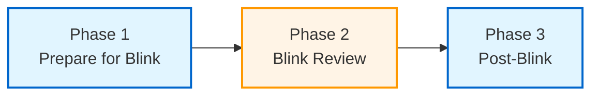

# Quick Start: Batch Processing Workflow

This guide walks through setting up Windows batch scripts to automate the
astrophotography processing pipeline. The workflow is split into three phases
with a manual blink review between the automated steps.

Template scripts are provided in [`templates/`](../templates/) and can be
copied to a working directory and customized for your system.

## Prerequisites

- Python 3.10+
- [PixInsight](https://pixinsight.com/) installed
- All pipeline tools installed (see [Installation](index.md#installation))
- NINA-captured data in the expected
  [raw capture structure](directory-structure.md#raw-capture-structure)

## Workflow Phases



| Phase | Type | Steps |
|-------|------|-------|
| **1. Prepare for Blink** | Automated | Preserve headers, move lights, cull poor frames |
| **2. Blink Review** | Manual | Visual inspection in blink tool |
| **3. Post-Blink** | Automated | Create masters, organize library, copy calibration, move to data |

## Setup

### 1. Copy Templates

Copy the [`templates/`](../templates/) directory to a working location on your
system:

```text
templates/
├── config.bat                  # Shared paths and settings
├── rigs/                       # One .bat per active rig
│   ├── example-rig1.bat
│   └── example-rig2.bat
├── 01-prepare-for-blink.bat    # Phase 1 script
└── 02-post-blink.bat           # Phase 3 script
```

### 2. Edit Shared Configuration

Open [`config.bat`](../templates/config.bat) and update all paths to match your
system: raw capture root, data directory, reject directory, calibration library,
calibration output, and PixInsight binary location.

### 3. Configure Active Rigs

Each file in the `rigs/` directory defines one active rig. The template
includes two examples:

- [`example-rig1.bat`](../templates/rigs/example-rig1.bat) - longer focal
  length scope with more tolerant HFR threshold
- [`example-rig2.bat`](../templates/rigs/example-rig2.bat) - shorter focal
  length scope with tighter HFR threshold

Rename these to match your rigs (e.g., `c8e-asi2600mm.bat`) and update:

- **`RIG_DIR`** - must match the profile directory name under `DATA_ROOT`
  exactly
- **Culling thresholds** - adjust per-rig quality limits (see
  [Choosing Thresholds](#choosing-thresholds))

Only rigs you are actively processing need a file here. The phase scripts
iterate over all `.bat` files in `rigs/`, so removing a file deactivates
that rig.

### Choosing Thresholds

Culling thresholds are rig-dependent. Longer focal lengths typically need
higher HFR tolerances due to image scale differences.

| Parameter | Purpose | Guidance |
|-----------|---------|----------|
| `CULL_RMS_MAX` | Max guiding error (arcsec) | Start at 2.0, tighten if guiding is solid |
| `CULL_RMS_AUTO_ACCEPT` | Auto-accept if rejection % is below this | 100 = always auto-accept RMS rejections |
| `CULL_HFR_MAX` | Max star size (pixels) | Scale with focal length; shorter FL = tighter |
| `CULL_HFR_AUTO_ACCEPT` | Auto-accept if rejection % is below this | Lower = more conservative, prompts for review |

## Phase 1: Prepare for Blink

Run [`01-prepare-for-blink.bat`](../templates/01-prepare-for-blink.bat).

This script:

1. **Preserves headers** - writes path-encoded metadata (instrument, offset,
   readout mode for lights; camera, optic, filter for calibration frames) into
   FITS headers. This must happen before files are moved, since the organized
   directory structure may not preserve all path information.
   See [ap-preserve-header](tools/ap-preserve-header.md).

2. **Moves lights** - reorganizes raw light frames into the
   `{rig}/10_Blink/{target}/DATE_{date}/FILTER_{filter}_EXP_{exp}/` structure.
   See [ap-move-raw-light-to-blink](tools/ap-move-raw-light-to-blink.md).

3. **Culls frames** - rejects outliers based on HFR and RMS thresholds defined
   in each rig's config. RMS culling runs first (guiding errors), then HFR
   (focus quality). See [ap-cull-light](tools/ap-cull-light.md).

The script pauses when complete so you can proceed to blink review.

## Phase 2: Blink Review

Open your blink/review tool and manually inspect the remaining frames. Accept
good frames and reject any the automated culling missed. This is the only
manual step in the workflow.

## Phase 3: Post-Blink

Run [`02-post-blink.bat`](../templates/02-post-blink.bat).

This script:

1. **Creates masters** - generates master bias, dark, and flat frames using
   PixInsight. Bias and darks are created first because flat calibration
   requires them. See [ap-create-master](tools/ap-create-master.md).

2. **Moves to library** - organizes each master type into the calibration
   library structure.
   See [ap-move-master-to-library](tools/ap-move-master-to-library.md).

3. **Copies to blink** - matches calibration frames from the library to light
   frames in each rig's blink directory based on FITS header metadata.
   See [ap-copy-master-to-blink](tools/ap-copy-master-to-blink.md).

4. **Moves to data** - moves light frames from `10_Blink` to `20_Data` only
   when all required calibration (dark, flat, and bias if needed) is present.
   See [ap-move-light-to-data](tools/ap-move-light-to-data.md).

## Managing Rigs

### Adding a Rig

Copy one of the example rig files to a new file in `rigs/` and update
`RIG_DIR` and the culling thresholds.

### Deactivating a Rig

Move the `.bat` file out of `rigs/` (e.g., to a `rigs/inactive/` directory).
The phase scripts only process files present in `rigs/`.

### Multiple Rigs, Shared Library

All rigs share a single calibration library (`CAL_LIBRARY`). Master frames are
matched to lights by FITS header metadata (camera, gain, offset, temperature,
etc.), so different rigs' calibration files coexist without conflict.

## Dry Run

All pipeline tools support `--dryrun` to preview changes without modifying
files. When setting up for the first time, add `--dryrun` to each command in
the phase scripts to verify the workflow before committing to file moves.

## Next Steps

- [Directory Structure](directory-structure.md) - Understand the full
  directory layout
- [Workflow Guide](workflow.md) - Detailed explanation of each processing stage
- [Tool Reference](tools/) - CLI options for each tool
